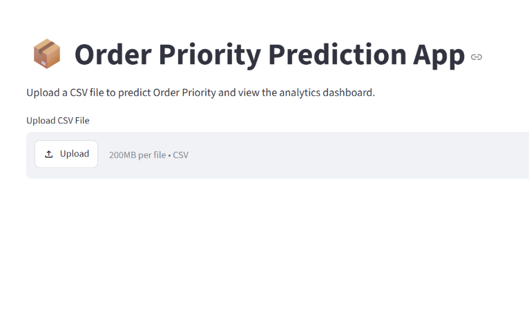
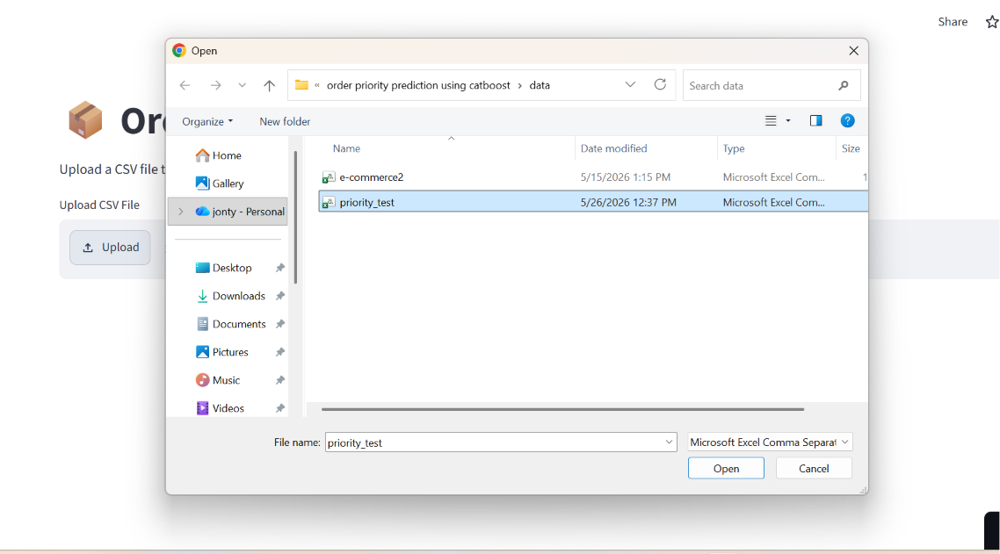
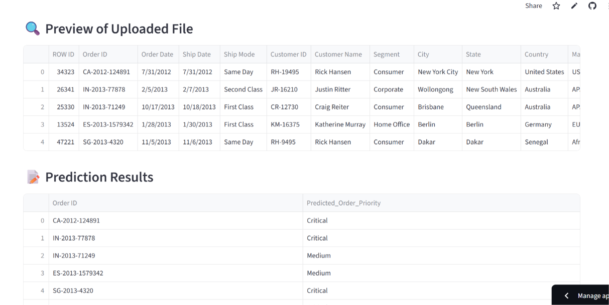
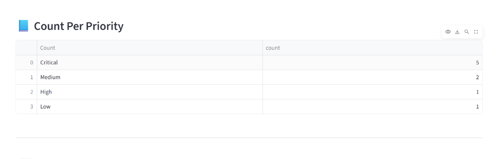
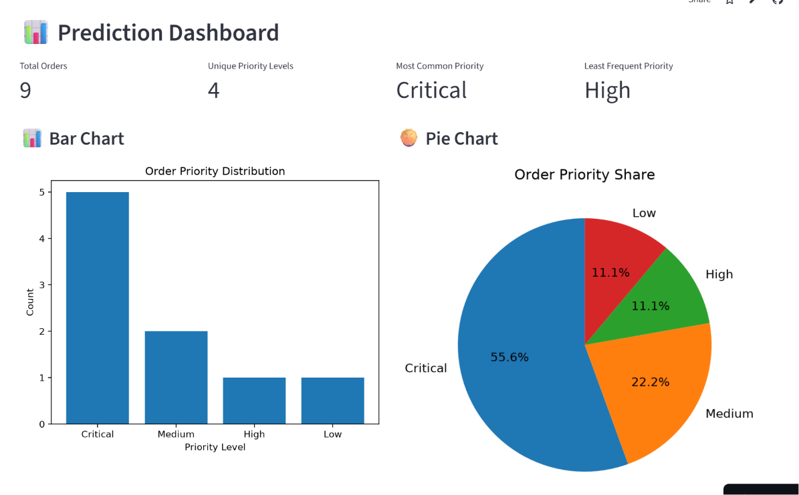
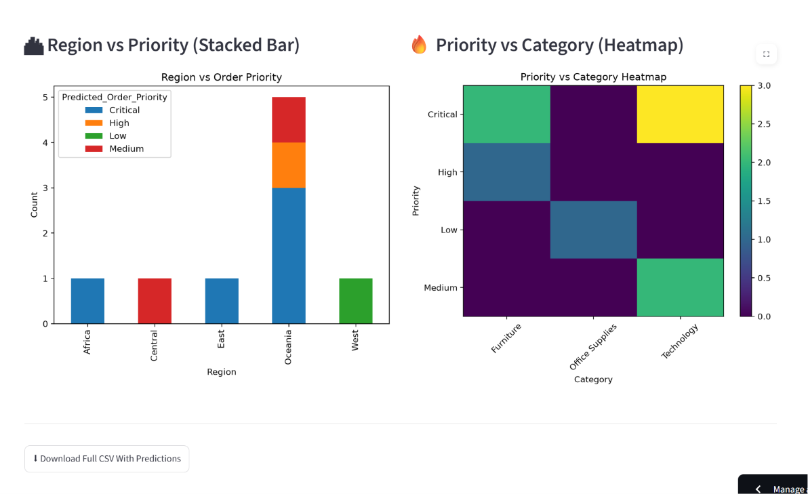

<h1> Order Priority Prediction Using Catboost </h1>

<h2>Overview</h2>

This project is a ML-powered web application built using Streamlit that predicts Order Priority from e-commerce order data. The application allows users to upload a CSV file, generate predictions using CatBoost model, visualize insights through interactive dashboards, and download prediction outputs.

<h2>Problem Statement</h2>

Businesses process thousands of customer orders every day, making it difficult to manually assign the correct order priority. Incorrect prioritization can lead to delayed deliveries, inefficient resource allocation, and reduced customer satisfaction. An automated solution is needed to accurately predict order priority based on historical order data.

<h2>Solution</h2>

This project provides a Machine Learning-based solution that predicts order priority using CatBoost model. Built with Streamlit, the application allows users to upload order data, generate predictions, visualize insights through interactive dashboards, compare model outputs, and download prediction results for further analysis.

<h2>Features</h2>

<h3>🐈 CatBoost Model</h3>
<ul>
    <li>A gradient boosting algorithm that handles categorical features efficiently and often provides strong performance on structured datasets.</li>
    <li>Predicts Order Priority using CatBoost</li>
    <li>Displays prediction results</li>
    <li>Interactive dashboard with KPIs and visualizations</li>
    <li>Download predictions as CSV</li>
</ul>

<h2>📊 Dashboard Analytics</h2>

<h3>Key Performance Indicators (KPIs)</h3>
<ul>
    <li>Total Orders</li>
    <li>Unique Priority Levels</li>
    <li>Most Common Priority</li>
    <li>Least Frequent Priority</li>
</ul>

<h3>Visualizations</h3>
<ul>
    <li>Count of Orders by Priority (Bar Chart)</li>
    <li>Priority Distribution (Pie Chart)</li>
    <li>Priority vs Region (Stacked Bar)</li>
    <li>Category vs Priority (Heatmap)</li>
</ul>

<h2>Technologies Used</h2>

<ul>
    <li>Python</li>
    <li>Streamlit</li>
    <li>Pandas</li>
    <li>NumPy</li>
    <li>Matplotlib</li>
    <li>Seaborn</li>
    <li>Scikit-learn</li>
    <li>CatBoost</li>
</ul>

<h2>Installation Instructions </h2>

<ol>
<li>
        Download all the files from the GitHub repository:
         
        <a href="https://github.com/jayant-kadam/order-priority-prediction-using-catboost">
            GitHub Repository
        </a>
</li>

<li>Create a project folder and copy all downloaded files into it.</li>

<li>Run the <strong>app.py</strong> file using your preferred IDE.</li>

<li>
        Upload the <strong>priority_test</strong> CSV file and the model will predict
        Order Priority and generate an interactive dashboard.
</li>

<li>Input data must be provided in <strong>.csv</strong> format.</li>

<li>
        The input CSV file must contain the following columns:
        

ROW ID, Order ID, Order Date, Ship Date, Ship Mode, Customer ID, Customer Name, Segment, City, State, Country, Market,
Region, Product ID, Category, Sub-Category, Product Name, Sales, Quantity, Discount, Shipping Cost, Profit, Order Year,
Order Month, Order Day, Ship Year, Ship Month, Ship Day, Delivery Time, Cost
        

</li>

<li>
    Also alternatively, one can try online version by clicking on link below:
    https://order-priority-prediction-using-catboost.streamlit.app/
</li>
</ol>

<h2>Prreview</h2>

<h3>Home Page</h3>

  

<h3>File Upload</h3>

  

<h3>Uploaded File Preview And Prediction Preview</h3>

  

<h3>Count Of Unique Predictions</h3>

  

<h3>Dashboad</h3>

  

  

<h2>Author</h2>

<strong>Jayant Kadam</strong> 
Data Analyst 
https://www.linkedin.com/in/jayantkadam/

